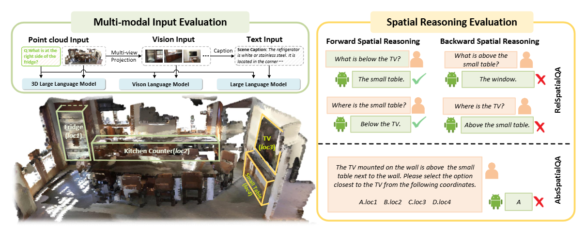

# The Point, the Vision and the Text: Does Point Cloud Boost Spatial Reasoning of Large Language Models?

<div align="center" style="line-height: 1;">
  <a href="" target="_blank"></a>
  <a href="https://huggingface.co/datasets/EmbodiedCity/ScanReQA/tree/main/datasets" target="_blank"></a>
  <a href="https://creativecommons.org/licenses/by/4.0/" target="_blank"></a>
</div>


Despite some promising results, the advantages of point clouds over other modalities remain unclear. Moreover, existing 3D benchmarks are insufficient for fairly evaluating the ability of multimodal LLMs to comprehend spatial concepts. To address these challenges, we introduce ScanReQA, a 3D spatial reasoning benchmark encompassing text, vision, and point cloud modalities.



[//]: # (to do: add arxiv link and dataset link)
______________________________________________________________________

## 📢 News
- [x] Preprint version released
- [x] ScanReQA dataset released
- [x] Evaluation code and cached results released
______________________________________________________________________

## 1. Environment Setup

```bash
conda create -n scanreqa python=3.9 -y
conda activate scanreqa
```

Then install the required packages:
```bash
pip install -r requirements.txt
```

Notes:

- `evaluate/em_acc_recall.py` uses the bundled `meteor-1.5.jar` for the `METEOR` metric. `Java` must be installed on the machine if you want to compute `METEOR`.


<!-- ### 1.3 Data Layout

The repository assumes the following default directories:

- Attention cache:
  - `output_cache/Attention_cache/scanqa_shuffled_token`
  - `output_cache/Attention_cache/relspatialqa_shuffled_token`
  - `output_cache/Attention_cache/scanqa_shuffled_token_full`
  - `output_cache/Attention_cache/relspatialqa_shuffled_token_full`
- Evaluation results:
  - `output_cache/Eval_result_ScanQA/PC`
  - `output_cache/Eval_result_SQA3D/PC`
  - `output_cache/Eval_result_RespatialQA/PC`
  - `output_cache/Eval_result_AbsSpatialQA/PC`
  - `output_cache/Attention_eval_result` -->

## 2. Dataset
Download dataset from [here](https://huggingface.co/datasets/EmbodiedCity/ScanReQA/tree/main/datasets). The dataset is formatted as follows:

### 2.1 `Rel_SpatialQA.json`
Each item in `Rel_SpatialQA.json` corresponds to one relative spatial reasoning question and shares several fields with `Abs_SpatialQA.json`, while adding relation-specific annotations:

- `question_id`
  Unique sample identifier, for example `val-scene0011-2-0`.
- `scene_id`
  ScanNet scene identifier, for example `scene0011_00`.
- `question`
  The relative spatial reasoning question.
- `answers`
  A list of valid textual answers.
- `referred_obj_utterance`
  The natural-language sentence that states the original relation.
- `referred_obj_name`
  The name of the referred target object.
- `referred_obj_id`
  The integer object id of the referred target object.
- `object_ids`
  A list of scene object ids involved in the question context.
- `object_names`
  A list of object category names aligned with `object_ids`.
- `object_captions`
  A list of textual descriptions aligned with `object_ids` and `object_names`.
- `spatial_triplet`
  A three-element list in the form `[target, relation, anchor]`.
- `spatial_triplet_reversed`
  The reversed relational form corresponding to `spatial_triplet`.
- `reversible`
  An integer flag indicating whether the relation can be meaningfully reversed.

Example:

```json
{
  "answers": ["the brown wooden chair"],
  "object_ids": [2, 9],
  "object_names": ["table", "chair"],
  "question": "What is at the head of the long rectangular table?",
  "question_id": "val-scene0011-2-0",
  "scene_id": "scene0011_00",
  "object_captions": [
    "Caption for object 2",
    "Caption for object 9"
  ],
  "referred_obj_utterance": "The brown wooden chair is placed at the head of the long rectangular table.",
  "referred_obj_name": "the brown wooden chair.",
  "referred_obj_id": 9,
  "spatial_triplet": ["the brown wooden chair", "at the head of", "the long rectangular table"],
  "spatial_triplet_reversed": ["the long rectangular table", "at the foot of", "the brown wooden chair"],
  "reversible": 1
}
```

### 2.2 `Abs_SpatialQA.json`
Each item in `Abs_SpatialQA.json` corresponds to one absolute spatial reasoning question and contains the following fields:

- `question_id`
  Unique sample identifier, for example `val-scene0011-2`.
- `scene_id`
  ScanNet scene identifier, for example `scene0011_00`.
- `question`
  The full multiple-choice absolute spatial reasoning question.
- `answers`
  A list of valid answers. In the current release this is typically a single option such as `["B"]`.
- `referred_obj_utterance`
  The natural-language reference sentence that describes the target object.
- `referred_obj_name`
  The textual name of the target object mentioned in the question context.
- `referred_obj_id`
  The integer object id of the referred target object in the scene.
- `referred_obj_ans`
  The correct multiple-choice option for the referred object, such as `B`.
- `object_ids`
  A list of scene object ids that are explicitly involved in the question context.
- `object_names`
  A list of object category names aligned with `object_ids`.
- `object_captions`
  A list of textual descriptions aligned with `object_ids` and `object_names`.

Example:

```json
{
  "answers": ["B"],
  "object_ids": [2, 9],
  "object_names": ["table", "chair"],
  "question": "The brown wooden chair is placed at the head of the long rectangular table. What's the central coordinate of the the brown wooden chair.Please select the option closest to the brown wooden chair from the following coordinate options. Your answer can only be one of A, B, C, and D.",
  "question_id": "val-scene0011-2",
  "scene_id": "scene0011_00",
  "object_captions": [
    "Caption for object 2",
    "Caption for object 9"
  ],
  "referred_obj_utterance": "The brown wooden chair is placed at the head of the long rectangular table.",
  "referred_obj_name": "the brown wooden chair.",
  "referred_obj_id": 9,
  "referred_obj_ans": "B"
}
```

## 3. Evaluation
We provide the evaluation code and example outputs for 3D LLMs. To evaluate a custom model, please ensure that its output format is consistent with the provided examples.

Each output file is a json list. Each item in the list corresponds to one evaluation example and has the following fields:

- `source`
  The unique sample identifier. Example: `val-scene0011-0`.
- `scene_id`
  The ScanNet scene identifier for the sample. Example: `scene0011_00`.
- `instruction`
  The full input prompt given to the model, usually including the `USER` question and the `ASSISTANT` prefix.
- `response_gt`
  A list of ground-truth answers. Multiple equivalent reference answers may be provided for the same question.
- `response_pred`
  The model prediction for the sample.

Example:

```json
{
  "source": "val-scene0011-0",
  "scene_id": "scene0011_00",
  "instruction": "USER: What color is the chair in the kitchen? ASSISTANT:",
  "response_gt": ["dark brown", "brown"],
  "response_pred": "brown"
}
```

To run the evaluation code on cached output, download [output_cache](https://huggingface.co/datasets/EmbodiedCity/ScanReQA/tree/main) to the current directory and run the following code.


### 3.1 EM of Different 3D LLMs on ScanQA, SQA3D, and RelSpatialQA
Evaluate different 3D LLMs with `EM` and `refined-EM` on spatial QA benchmarks. Report `CIDEr`, `BLEU-4`, `METEOR`, and `ROUGE` at the same time.


**ScanQA**:

```bash
python evaluate/em_acc_recall.py \
  evaluate-main-results \
  --repo-root . \
  --target-split Eval_result_ScanQA \
  --modal PC \
  --suffix ''
```

**SQA3D**:

```bash
python evaluate/em_acc_recall.py \
  evaluate-main-results \
  --repo-root . \
  --target-split Eval_result_SQA3D \
  --modal PC \
  --suffix ''
```

**RelSpatialQA**:

```bash
python evaluate/em_acc_recall.py \
  evaluate-main-results \
  --repo-root . \
  --target-split Eval_result_RespatialQA \
  --modal PC \
  --suffix ''
```

### 3.2 Accuracy and Recall of 3D LLMs on RelSpatialQA
Measure accuracy and recall on RelSpatialQA.

1. Prepare `Eval_result_RespatialQA/PC` and `Eval_result_ScanQA/PC`.
2. Run the RelSpatialQA command below.

```bash
python evaluate/em_acc_recall.py \
  evaluate-main-results \
  --repo-root . \
  --target-split Eval_result_RespatialQA \
  --scanqa-split Eval_result_ScanQA \
  --modal PC \
  --suffix ''
```

### 3.3 Accuracy of 3D LLMs on AbsSpatialQA
Measure accuracy on AbsSpatialQA.

1. Prepare `Eval_result_AbsSpatialQA/PC`.
2. Run `evaluate-main-results`.

```bash
python evaluate/em_acc_recall.py \
  evaluate-main-results \
  --repo-root . \
  --target-split Eval_result_AbsSpatialQA \
  --modal PC \
  --suffix ''
```

## 4. Attention Visualization

### 4.1 Attention on Tokens
Inspect the sliding-window attention distribution from response tokens to point-cloud tokens. Compare token-level attention patterns between successful and failed cases.

1. Use `output_cache/Attention_cache/{dataset}_shuffled_token`.
2. Use `output_cache/Attention_eval_result/{dataset}.json`.
3. Run `attention-on-tokens`.

**ScanQA**:

```bash
python evaluate/vis_attention.py \
  attention-on-tokens \
  --dataset scanqa
```

RelSpatialQA:

```bash
python evaluate/vis_attention.py \
  attention-on-tokens \
  --dataset relspatialqa
```

Optional arguments:

- `--max-cases`: the maximum evaluated cases
- `--plot`: plot the results

### 4.2 Attention on Target Token
Measure whether the model places attention on the true target-object tokens.

1. Choose the dataset.
2. Run `attention-on-target-token`.

**ScanQA**:

```bash
python evaluate/vis_attention.py \
  attention-on-target-token \
  --dataset scanqa
```

**RelSpatialQA**:

```bash
python evaluate/vis_attention.py \
  attention-on-target-token \
  --dataset relspatialqa
```


### 4.3 Attention on Sink Tokens
Measure how much attention is assigned to sink tokens after shuffling. Compare sink-token attention between successful and failed cases.


**ScanQA**:

```bash
python evaluate/vis_attention.py \
  attention-on-sink-token \
  --dataset scanqa
```

**RelSpatialQA**:

```bash
python evaluate/vis_attention.py \
  attention-on-sink-token \
  --dataset relspatialqa
```


## 5. Logit Lens Evaluation
Inspect the top decoded tokens from point-cloud tokens and response tokens across transformer layers. Analyze when semantic information becomes identifiable during spatial reasoning.


1. Prepare a locally available Vicuna/LLaMA base model.
2. Prepare a full cache directory that contains `all_hidden_states`.
3. Run `evaluate/logit_lens.py`.
4. Read the output from `--save-dir/results.json`.

### 5.1 ScanQA

```bash
python evaluate/logit_lens.py \
  --base-model /path/to/base_model \
  --save-dir output_cache/logit_lens_scanqa \
  --eval-count 1
```

### 5.2 RelSpatialQA

```bash
python evaluate/logit_lens.py \
  --base-model /path/to/base_model \
  --att-dir output_cache/Attention_cache/relspatialqa_shuffled_token_full \
  --save-dir output_cache/logit_lens_relspatialqa \
  --eval-count 1
```

## Acknowledgements
This repository builds on several excellent open-source projects. 
We thank [llava-interp](https://github.com/clemneo/llava-interp) for attention and logit-lens analysis references, 
[embodied-generalist](https://github.com/embodied-generalist/embodied-generalist) and [3D-LLM](https://github.com/UMass-Embodied-AGI/3D-LLM) for the original 3D evaluation and model analysis codebase.

